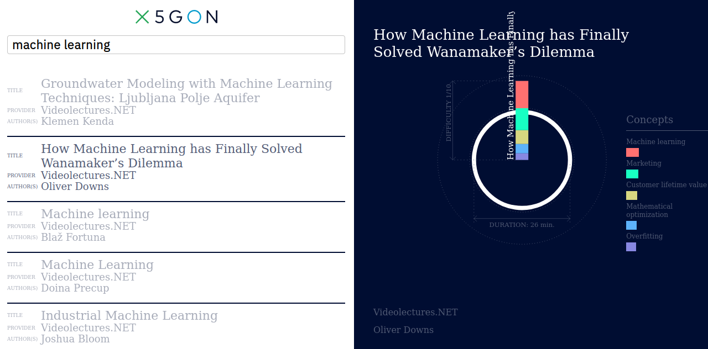

# Learning Analytics Machine Dashboard (LAM Dashboard)

[![Contributors][contributors-shield]][contributors-url]
[![Forks][forks-shield]][forks-url]
[![Stargazers][stars-shield]][stars-url]
[![Issues][issues-shield]][issues-url]
[![License][license-shield]][license-url]

<!-- PROJECT LOGO -->

  
  

    <a href="https://www.x5gon.org/wp-content/uploads/2020/04/D3.3_final.pdf"><strong>Explore the full documentation »</strong></a>
     
     
    <a href="https://wp3.x5gon.org">View Demo</a>
    ·
    <a href="https://github.com/X5GON/lamdashboard/issues">Report Bug</a>
    ·
    <a href="https://github.com/X5GON/lamdashboard/issues">Request Feature</a>
  

<!-- TABLE OF CONTENTS -->

  
Table of Contents

  <ol>
    <li>
      <a href="#about-the-project">About The Project</a>
      <ul>
        <li><a href="#built-with">Built With</a></li>
        <li><a href="#architecture">Architecture</a></li>
      </ul>
    </li>
    <li>
      <a href="#getting-started">Getting Started</a>
      <ul>
        <li><a href="#installation">Installation</a></li>
        <li><a href="#debugging">Debugging</a></li>
      </ul>
    </li>
    <li><a href="#usage">Usage</a></li>
    <li><a href="#roadmap">Roadmap</a></li>
    <li><a href="#contributing">Contributing</a></li>
    <li><a href="#license">License</a></li>
    <li><a href="#contact">Contact</a></li>
  </ol>

<!-- ABOUT THE PROJECT -->
## About The Project

The X5GON project stands for easily implemented freely available innovative technology elements that will converge currently scattered Open Educational Resources (OER) available in various modalities across Europe and the globe.

X5GON's Learning Analytics Machine (LAM) is capable of dealing with multi-lingual collections of OER. We can give you insight into the usage of your resources across different languages, make your content seen across the world and see how your resources are being used in different cultures.

The X5GON LAM Dashboard (models dashboard) is a web dasboard based on the LAM API aiming to show a specific learning use case which is "Exploring in deep the OERs in order to construct a coherent course set of materials".

### Built With

The code is conceived to be build-less, directly usable from any
checkout of the code.

It is implemented using the VueJS framework. Most components are
defined in .vue syntax and loaded through http-vue-loader. This
approach has one major drawback: since code is dynamically loaded and
interpreted, the devtools interaction is not as direct as it could be.

### Architecture

All application-wide state (search results, basket, sequence) is
stored in the Store component, especially interactions with the API.

## Getting Started

### Installation

Hacking: it is advised to install vuejs devtools extensions to facilitate debugging.

### Debugging

If you enter a query in the form d:NAME the application will fetch
data/NAME.json as debug data. It will use it to populate search
results, basket and sequence.

## Usage

Once up and running, here is how it's looking the LAM Dashboard, the [Official X5GON LAM Dashboard](https://wp3.x5gon.org).
Some functionnalities:

1. The "OER neighborhood":

[![OER neighborhood][oer-neighborhood]](readme/oer_neighborhood.png)

2. "OREs in the Basket, ready to be exported":

[![OREs in the Basket][oers-inthebasket]](readme/oers_set_inthebasket.png)

<!-- ROADMAP -->
## Roadmap

See the [open issues](https://github.com/X5GON/lamdashboard/issues) for a list of proposed features (and known issues).

<!-- CONTRIBUTING -->
## Contributing

Contributions are what make the open source community such an amazing place to be learn, inspire, and create. Any contributions you make are **greatly appreciated**.

1. Fork the Project
2. Create your Feature Branch (`git checkout -b feature/AmazingFeature`)
3. Commit your Changes (`git commit -m 'Add some AmazingFeature'`)
4. Push to the Branch (`git push origin feature/AmazingFeature`)
5. Open a Pull Request

<!-- LICENSE -->
## License

Distributed under the [MIT License](https://opensource.org/licenses/MIT) License. See [LICENSE](LICENSE.txt) for more information.

<!-- CONTACT -->
## Contact

### Authors

Architecture and implementation:
* Olivier Aubert - [@oaubert](https://github.com/oaubert) - <contact@olivieraubert.net>

Graphical design:
* Maxime Zoffoli - <mail@maximezoffoli.com>

### Contributers
Some miner contributions were done in order to fit with the LAM API specifications:
* Victor Connes - <Victor.Connes@univ-nantes.fr>
* Colin de la Higuera - <cdlh@univ-nantes.fr>
* Walid Ben Romdhane - [@walidbrw](https://github.com/walidbrw) - <walid_benromdhane@hotmail.fr>

<!-- MARKDOWN LINKS & IMAGES -->
[contributors-shield]: https://img.shields.io/github/contributors/X5GON/lamdashboard.svg?style=for-the-badge
[contributors-url]: https://github.com/X5GON/lamdashboard/-/graphs/master
[forks-shield]: https://img.shields.io/github/forks/X5GON/lamdashboard.svg?style=for-the-badge
[forks-url]: https://github.com/X5GON/lamdashboard/network/members
[stars-shield]: https://img.shields.io/github/stars/X5GON/lamdashboard.svg?style=for-the-badge
[stars-url]: https://github.com/X5GON/lamdashboard/-/starrers
[issues-shield]: https://img.shields.io/github/issues/X5GON/lamdashboard.svg?style=for-the-badge
[issues-url]: https://github.com/X5GON/lamdashboard/-/issues
[license-shield]: https://img.shields.io/github/license/X5GON/lamdashboard.svg?style=for-the-badge
[license-url]: https://github.com/X5GON/lamdashboard/blob/master/LICENSE
[license]: https://img.shields.io/badge/License-MIT-green.svg
[license-link]: https://opensource.org/licenses/MIT

[project-screenshot]: readme/lamdashboard.png
[oer-neighborhood]: readme/oer_neighborhood.png
[oers-inthebasket]: readme/oers_set_inthebasket.png
